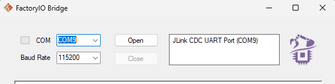
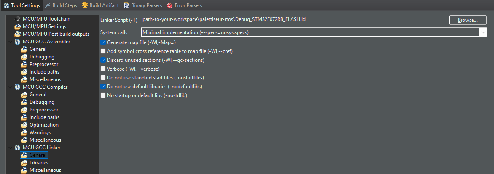
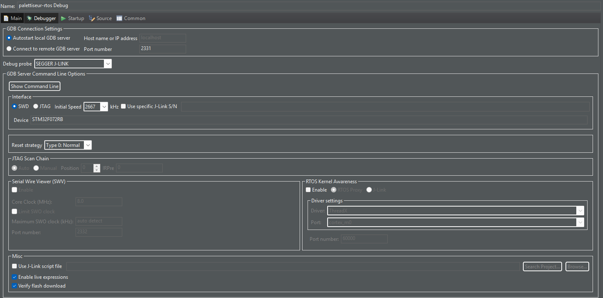

# The Palletizer!


It's a project that simulates a factory palletizer in a Factory IO scene. 
Develloped for the course of Real time Operating Systems @ Polytech Montpellier.
We use FreeRTOS, Percepio Tracealyzer and Factory IO as tools.

##### Full video of it running on [YouTube](https://youtu.be/gn89jhgpf5w)

## How to run

### Dependencies
To run it, you gotta have [Factory I/O](https://factoryio.com/) running in [2.4.5](https://realgames.b-cdn.net/fio/factoryio-installer-latest.exe).

You will also need [Python 3](https://www.python.org/downloads) installed for the bridge script component allowing to comunicate with the STM board and Factory I/O.

For the board, we use the STM32F072 model, in a [STM32CubeIDE](https://www.st.com/en/development-tools/stm32cubeide.html) environment.

It's also recommended to have [Percepio's Tracealyzer](https://percepio.com/tracealyzer/) installed to analyse task timing. Even though is not necessary for the project to run, running without it will demand you to comment/remove each tracealyzer line in the code.

### Steps
It's good to know that this project wasn't run on Linux yet, so the next step by step guide shows how you should configurate in Windows.

#### 1. In Windows, open `Device Manager` and check the port your STM is connected (if it's not, connect it!)

#### 2. Copy/Memorize the port name (e.g.: `COM7`), we are using it just after.
#### 3. Adapt your bridge:

You can open the bridge executable, it's easier. It can be found in `bridge/lib/Bridge.exe`.
Change the COM option to the one you found in Device Manager, set Baud rate to `115200` and click `open`.




Skip to Step 3. If this doesn't work, you can try with the python bridge:

1. Open your python bridge:
```bash
cd bridge
```
2. Edit the last line with the code you found in your peripheral manager:
```python
EngineIO_Controller(port='COM6', baudrate=115200, timeout=.5, rate=0.016,  verbose=True)
```
3. Save it and run it.
```bash
python run.py
```

#### 3. Open the Facroty IO Palletizer scene in the Factory IO simulator. 
The scene can be found in `assets/Palettiseur_scene.factoryio` in the root folder of this repository. You open The program Factory IO, add the `Palletiseur_scene.factoryio` file inside the FactoryIO `MyScenes/` folder (usually: `C:\Users\<your-user>\Documents\Factory IO\My Scenes`) and run it.

#### 4. Set your STM board for J-Link Segger 
You can follow one of these tutorials, wichever available:
- [Tutorial 1](https://moodle.umontpellier.fr/mod/page/view.php?id=358464)
- [Tutorial 2](https://www.pomad.fr/tutorials/freertos/trace_streaming)

#### 5. Setup up your debugger by going to Debugger Cofigurations .
Open up the project inside STMCubeIDE.

In Project Explorer tab, right click the project name `palettiseur-rtos`. Then go to `Properties`, open up `C/C++ Build`, select `Settings`, inside Tool Settings tab, select `MCU GCC Linker` > `General`. Go over the `Linker Script (-T)` option, select `Browse` and search and select the file  `Debug_STM32F072RB_FLASH.ld`.



Apply and close, open Debug Configurations in the top of eclipse IDE, go to `Debugger` and verify it's the same as the following image.



Build and Debug, this can give errors if first try, redo if necessary.

#### 6. Open TraceAlyzer and set ready.

Follow the tutorial after topic `3. Time to stream!` :
[Pomad Tutorial](https://www.pomad.fr/tutorials/freertos/trace_streaming)

#### 7. Run the debugger in STM32CubeIDE to program your board, and run the code.

You should see the scene rolling in Factory I/O.

### Run without Tracealyzer

You gotta change this line in `app/inc/FreeRTOSConfig.h`
```c
#define configUSE_TRACE_FACILITY 0 // <= set 0 here
```

And comment in `main.c`
```c
// 	xTraceEnable(TRC_START);
```


